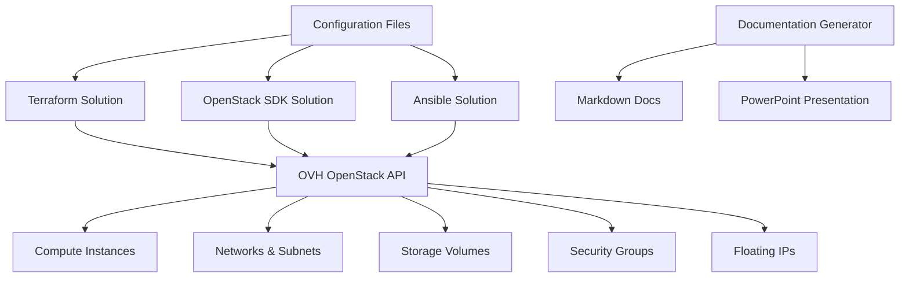
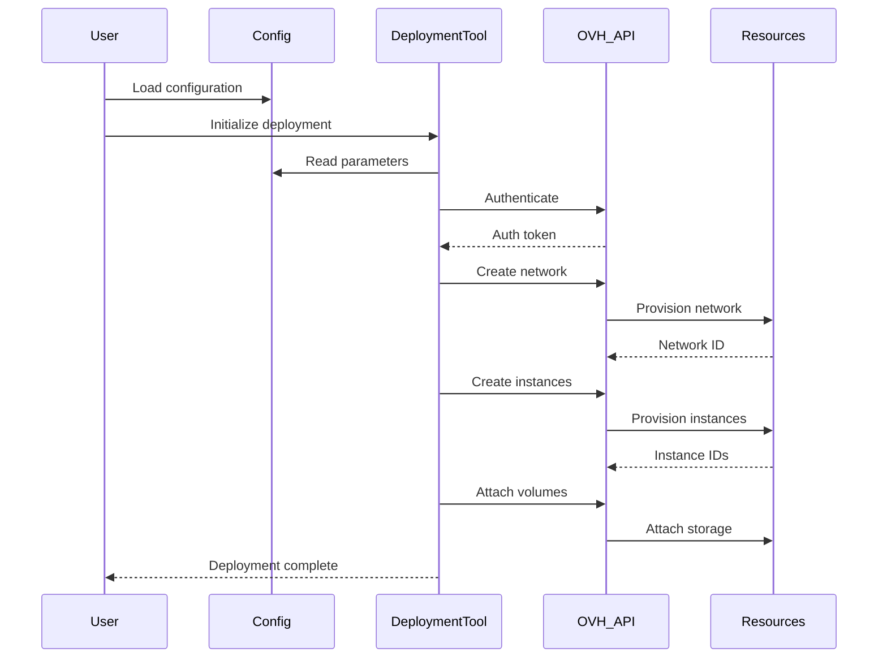

# Design Document: OVH OpenStack Deployment Automation

## Overview

This project provides multiple automated solutions for deploying baremetal OVH OpenStack private cloud infrastructure. The system implements three distinct deployment approaches: Terraform-based Infrastructure as Code, OpenStack SDK-based programmatic deployment, and Ansible-based configuration management. Each solution is designed to be standalone yet follows consistent patterns for configuration, authentication, and resource management. The project includes comprehensive documentation and presentation materials to facilitate comparison and stakeholder communication.

The architecture supports experimentation with different deployment methodologies while maintaining a unified configuration schema. All solutions interact with OVH's OpenStack API to provision compute instances, networks, storage volumes, security groups, and other cloud resources. The design emphasizes modularity, reusability, and clear separation of concerns to enable easy comparison between approaches.

## Architecture



## Main Workflow: Deployment Process




## Components and Interfaces

### Component 1: Configuration Manager

**Purpose**: Centralized configuration management for all deployment solutions

**Interface**:
```python
class ConfigurationManager:
    def load_config(file_path: str) -> DeploymentConfig
    def validate_config(config: DeploymentConfig) -> ValidationResult
    def get_auth_credentials() -> AuthCredentials
    def get_resource_specs() -> ResourceSpecifications
```

**Responsibilities**:
- Load and parse configuration files (YAML/JSON)
- Validate configuration parameters
- Provide authentication credentials
- Supply resource specifications to deployment tools

### Component 2: Terraform Deployment Engine

**Purpose**: Infrastructure as Code deployment using Terraform

**Interface**:
```hcl
# Terraform module interface
module "ovh_openstack_deployment" {
  source = "./terraform"
  
  # Authentication
  auth_url          = var.auth_url
  username          = var.username
  password          = var.password
  tenant_name       = var.tenant_name
  region            = var.region
  
  # Instance configuration
  instance_count    = var.instance_count
  instance_flavor   = var.instance_flavor
  instance_image    = var.instance_image
  
  # Network configuration
  network_name      = var.network_name
  subnet_cidr       = var.subnet_cidr
  
  # Storage configuration
  volume_size       = var.volume_size
  volume_count      = var.volume_count
}
```

**Responsibilities**:
- Define infrastructure as declarative code
- Manage resource state
- Handle resource dependencies
- Provide idempotent deployments

### Component 3: OpenStack SDK Deployment Engine

**Purpose**: Programmatic deployment using OpenStack Python SDK

**Interface**:
```python
class OpenStackDeploymentEngine:
    def __init__(self, auth_config: AuthConfig)
    def connect() -> Connection
    def create_network(network_spec: NetworkSpec) -> Network
    def create_subnet(subnet_spec: SubnetSpec) -> Subnet
    def create_instance(instance_spec: InstanceSpec) -> Server
    def create_volume(volume_spec: VolumeSpec) -> Volume
    def attach_volume(instance_id: str, volume_id: str) -> bool
    def create_security_group(sg_spec: SecurityGroupSpec) -> SecurityGroup
    def deploy_infrastructure(deployment_spec: DeploymentSpec) -> DeploymentResult
    def cleanup_resources(resource_ids: List[str]) -> CleanupResult
```

**Responsibilities**:
- Programmatic API interaction
- Resource lifecycle management
- Error handling and retry logic
- Deployment orchestration

### Component 4: Ansible Deployment Engine

**Purpose**: Configuration management and deployment using Ansible

**Interface**:
```yaml
# Ansible role interface
- name: Deploy OVH OpenStack Infrastructure
  hosts: localhost
  roles:
    - role: ovh_openstack_deployment
      vars:
        auth_url: "{{ openstack_auth_url }}"
        username: "{{ openstack_username }}"
        password: "{{ openstack_password }}"
        tenant_name: "{{ openstack_tenant }}"
        region: "{{ openstack_region }}"
        instances: "{{ instance_specifications }}"
        networks: "{{ network_specifications }}"
        volumes: "{{ volume_specifications }}"
```

**Responsibilities**:
- Declarative resource management
- Idempotent operations
- Task orchestration
- State verification

### Component 5: Documentation Generator

**Purpose**: Generate comprehensive documentation and presentation materials

**Interface**:
```python
class DocumentationGenerator:
    def generate_markdown(solutions: List[Solution]) -> str
    def generate_powerpoint(solutions: List[Solution]) -> Presentation
    def add_architecture_diagram(pres: Presentation, diagram: Diagram) -> None
    def add_code_examples(pres: Presentation, examples: List[CodeExample]) -> None
    def add_comparison_table(pres: Presentation, comparison: ComparisonData) -> None
    def export_markdown(content: str, output_path: str) -> None
    def export_powerpoint(pres: Presentation, output_path: str) -> None
```

**Responsibilities**:
- Generate markdown documentation
- Create PowerPoint presentations
- Include diagrams and code examples
- Format comparison tables


## Data Models

### Model 1: DeploymentConfig

```python
class DeploymentConfig:
    auth_url: str
    username: str
    password: str
    tenant_name: str
    region: str
    project_name: str
    instances: List[InstanceSpec]
    networks: List[NetworkSpec]
    volumes: List[VolumeSpec]
    security_groups: List[SecurityGroupSpec]
```

**Validation Rules**:
- auth_url must be valid HTTPS URL
- username and password must be non-empty
- tenant_name and region must be non-empty
- At least one instance specification required
- All resource names must be unique within their type

### Model 2: InstanceSpec

```python
class InstanceSpec:
    name: str
    flavor: str              # e.g., "s1-2", "s1-4", "s1-8"
    image: str               # e.g., "Ubuntu 22.04", "Debian 11"
    key_name: str            # SSH key name
    network_ids: List[str]
    security_groups: List[str]
    user_data: Optional[str]
    metadata: Dict[str, str]
```

**Validation Rules**:
- name must be unique and follow naming conventions
- flavor must exist in OVH catalog
- image must exist in OVH catalog
- At least one network_id required
- key_name must reference existing SSH key

### Model 3: NetworkSpec

```python
class NetworkSpec:
    name: str
    admin_state_up: bool
    subnets: List[SubnetSpec]
    external: bool
```

**Validation Rules**:
- name must be unique
- At least one subnet required for private networks
- external flag determines if network is public-facing

### Model 4: SubnetSpec

```python
class SubnetSpec:
    name: str
    cidr: str                # e.g., "192.168.1.0/24"
    ip_version: int          # 4 or 6
    gateway_ip: Optional[str]
    dns_nameservers: List[str]
    enable_dhcp: bool
```

**Validation Rules**:
- cidr must be valid CIDR notation
- ip_version must be 4 or 6
- gateway_ip must be within CIDR range if specified
- dns_nameservers must be valid IP addresses

### Model 5: VolumeSpec

```python
class VolumeSpec:
    name: str
    size: int                # Size in GB
    volume_type: str         # e.g., "classic", "high-speed"
    bootable: bool
    image_id: Optional[str]
    attach_to: Optional[str] # Instance name to attach to
```

**Validation Rules**:
- size must be positive integer
- volume_type must be valid OVH volume type
- If bootable is true, image_id must be provided
- attach_to must reference existing instance if specified

### Model 6: SecurityGroupSpec

```python
class SecurityGroupSpec:
    name: str
    description: str
    rules: List[SecurityGroupRule]

class SecurityGroupRule:
    direction: str           # "ingress" or "egress"
    protocol: str            # "tcp", "udp", "icmp", or "any"
    port_range_min: Optional[int]
    port_range_max: Optional[int]
    remote_ip_prefix: str    # CIDR notation
    ethertype: str           # "IPv4" or "IPv6"
```

**Validation Rules**:
- direction must be "ingress" or "egress"
- protocol must be valid protocol identifier
- port_range_min <= port_range_max
- remote_ip_prefix must be valid CIDR notation
- ethertype must be "IPv4" or "IPv6"

### Model 7: DeploymentResult

```python
class DeploymentResult:
    success: bool
    deployment_id: str
    created_resources: Dict[str, List[str]]  # resource_type -> [resource_ids]
    failed_resources: List[FailedResource]
    duration_seconds: float
    timestamp: datetime
    
class FailedResource:
    resource_type: str
    resource_name: str
    error_message: str
```

**Validation Rules**:
- deployment_id must be unique UUID
- created_resources must map resource types to non-empty lists
- duration_seconds must be non-negative
- timestamp must be valid ISO 8601 format


## Key Functions with Formal Specifications

### Function 1: deploy_infrastructure()

```python
def deploy_infrastructure(config: DeploymentConfig, engine: DeploymentEngine) -> DeploymentResult
```

**Preconditions:**
- `config` is non-null and validated
- `config.auth_url` is reachable
- `config` credentials are valid for OVH OpenStack
- `engine` is initialized and connected
- All referenced resources (images, flavors, keys) exist in OVH catalog

**Postconditions:**
- Returns valid DeploymentResult object
- If `result.success == true`: all resources in `config` are created
- If `result.success == false`: `result.failed_resources` contains error details
- All created resources are recorded in `result.created_resources`
- No partial state: either all resources created or all rolled back
- `result.deployment_id` is unique and persisted

**Loop Invariants:**
- For each resource type: all previously created resources remain valid
- Resource dependencies are satisfied before dependent resource creation
- Authentication token remains valid throughout deployment

### Function 2: create_network_infrastructure()

```python
def create_network_infrastructure(network_specs: List[NetworkSpec], conn: Connection) -> List[Network]
```

**Preconditions:**
- `network_specs` is non-empty list of validated NetworkSpec objects
- `conn` is authenticated OpenStack connection
- All network names are unique
- All subnet CIDRs are non-overlapping

**Postconditions:**
- Returns list of created Network objects
- Length of returned list equals length of `network_specs`
- Each network has at least one subnet if specified in spec
- All networks are in "ACTIVE" state
- Network IDs are recorded for cleanup

**Loop Invariants:**
- All previously created networks remain in ACTIVE state
- No network name collisions occur
- Subnet CIDR ranges remain non-overlapping

### Function 3: create_compute_instances()

```python
def create_compute_instances(instance_specs: List[InstanceSpec], conn: Connection) -> List[Server]
```

**Preconditions:**
- `instance_specs` is non-empty list of validated InstanceSpec objects
- `conn` is authenticated OpenStack connection
- All referenced networks exist
- All referenced security groups exist
- All referenced SSH keys exist
- All flavors and images are available

**Postconditions:**
- Returns list of created Server objects
- Length of returned list equals length of `instance_specs`
- All instances are in "ACTIVE" or "BUILD" state
- Each instance is attached to specified networks
- Each instance has specified security groups applied
- Instance IDs are recorded for cleanup

**Loop Invariants:**
- All previously created instances remain in valid state
- Network attachments remain consistent
- Resource quotas are not exceeded

### Function 4: attach_volumes_to_instances()

```python
def attach_volumes_to_instances(volume_specs: List[VolumeSpec], instances: Dict[str, Server], conn: Connection) -> List[Volume]
```

**Preconditions:**
- `volume_specs` is list of validated VolumeSpec objects
- `instances` maps instance names to Server objects
- `conn` is authenticated OpenStack connection
- All instances referenced in `volume_specs` exist in `instances` dict
- All instances are in "ACTIVE" state

**Postconditions:**
- Returns list of created and attached Volume objects
- Each volume is in "in-use" state if attached, "available" if not
- Volumes are attached to correct instances as specified
- Bootable volumes have correct image_id set
- Volume IDs are recorded for cleanup

**Loop Invariants:**
- All previously attached volumes remain attached
- Instance states remain ACTIVE during attachment
- Volume attachment order is preserved

### Function 5: validate_deployment_config()

```python
def validate_deployment_config(config: DeploymentConfig) -> ValidationResult
```

**Preconditions:**
- `config` is non-null DeploymentConfig object

**Postconditions:**
- Returns ValidationResult with `is_valid` boolean
- If `is_valid == true`: config passes all validation rules
- If `is_valid == false`: `errors` list contains descriptive error messages
- No side effects on `config` object
- Validation is deterministic (same input always produces same result)

**Loop Invariants:**
- All previously validated fields remain valid
- Validation state is consistent throughout iteration


## Algorithmic Pseudocode

### Main Deployment Algorithm

```pascal
ALGORITHM deployInfrastructure(config, engine)
INPUT: config of type DeploymentConfig, engine of type DeploymentEngine
OUTPUT: result of type DeploymentResult

BEGIN
  ASSERT validateDeploymentConfig(config).is_valid = true
  
  // Step 1: Initialize deployment tracking
  deploymentId ← generateUUID()
  createdResources ← emptyMap()
  failedResources ← emptyList()
  startTime ← getCurrentTime()
  
  TRY
    // Step 2: Authenticate with OVH OpenStack
    connection ← engine.authenticate(config.auth_url, config.username, 
                                     config.password, config.tenant_name)
    ASSERT connection.is_authenticated = true
    
    // Step 3: Create network infrastructure
    networks ← createNetworkInfrastructure(config.networks, connection)
    createdResources["networks"] ← extractIds(networks)
    ASSERT allResourcesActive(networks) = true
    
    // Step 4: Create security groups
    securityGroups ← createSecurityGroups(config.security_groups, connection)
    createdResources["security_groups"] ← extractIds(securityGroups)
    
    // Step 5: Create compute instances with loop invariant
    instances ← emptyList()
    FOR each instanceSpec IN config.instances DO
      ASSERT allResourcesActive(instances) = true
      
      instance ← createInstance(instanceSpec, connection)
      instances.append(instance)
      
      ASSERT instance.status IN ["ACTIVE", "BUILD"]
    END FOR
    createdResources["instances"] ← extractIds(instances)
    
    // Step 6: Wait for all instances to become active
    waitForInstancesActive(instances, timeout=300)
    ASSERT allResourcesActive(instances) = true
    
    // Step 7: Create and attach volumes
    volumes ← createAndAttachVolumes(config.volumes, instances, connection)
    createdResources["volumes"] ← extractIds(volumes)
    
    // Step 8: Finalize deployment
    endTime ← getCurrentTime()
    duration ← endTime - startTime
    
    result ← DeploymentResult(
      success=true,
      deployment_id=deploymentId,
      created_resources=createdResources,
      failed_resources=failedResources,
      duration_seconds=duration,
      timestamp=endTime
    )
    
  CATCH error
    // Rollback on failure
    rollbackResources(createdResources, connection)
    
    result ← DeploymentResult(
      success=false,
      deployment_id=deploymentId,
      created_resources=emptyMap(),
      failed_resources=[FailedResource(error)],
      duration_seconds=getCurrentTime() - startTime,
      timestamp=getCurrentTime()
    )
  END TRY
  
  ASSERT result.deployment_id = deploymentId
  ASSERT result.success = true OR result.failed_resources IS NOT EMPTY
  
  RETURN result
END
```

**Preconditions:**
- config is validated and well-formed
- engine is initialized deployment engine
- OVH OpenStack API is accessible
- Authentication credentials are valid

**Postconditions:**
- result contains complete deployment information
- If successful: all resources created and active
- If failed: all resources rolled back
- deployment_id is unique and recorded

**Loop Invariants:**
- All previously created instances remain in valid state
- createdResources map accurately reflects created resources
- Authentication remains valid throughout execution

### Network Infrastructure Creation Algorithm

```pascal
ALGORITHM createNetworkInfrastructure(networkSpecs, connection)
INPUT: networkSpecs of type List[NetworkSpec], connection of type Connection
OUTPUT: networks of type List[Network]

BEGIN
  ASSERT connection.is_authenticated = true
  ASSERT networkSpecs IS NOT EMPTY
  
  networks ← emptyList()
  
  FOR each networkSpec IN networkSpecs DO
    ASSERT allNetworkNamesUnique(networks, networkSpec.name) = true
    
    // Create network
    network ← connection.network.create_network(
      name=networkSpec.name,
      admin_state_up=networkSpec.admin_state_up,
      external=networkSpec.external
    )
    
    // Create subnets for this network
    FOR each subnetSpec IN networkSpec.subnets DO
      subnet ← connection.network.create_subnet(
        network_id=network.id,
        name=subnetSpec.name,
        cidr=subnetSpec.cidr,
        ip_version=subnetSpec.ip_version,
        gateway_ip=subnetSpec.gateway_ip,
        dns_nameservers=subnetSpec.dns_nameservers,
        enable_dhcp=subnetSpec.enable_dhcp
      )
      
      ASSERT subnet.network_id = network.id
    END FOR
    
    networks.append(network)
    ASSERT network.status = "ACTIVE"
  END FOR
  
  ASSERT length(networks) = length(networkSpecs)
  ASSERT allResourcesActive(networks) = true
  
  RETURN networks
END
```

**Preconditions:**
- connection is authenticated
- networkSpecs is non-empty list
- All network names are unique
- All subnet CIDRs are valid and non-overlapping

**Postconditions:**
- Returns list of created networks
- All networks are in ACTIVE state
- Each network has specified subnets created
- Network count matches input spec count

**Loop Invariants:**
- All previously created networks remain ACTIVE
- Network names remain unique
- Subnet associations remain consistent

### Instance Creation Algorithm

```pascal
ALGORITHM createInstance(instanceSpec, connection)
INPUT: instanceSpec of type InstanceSpec, connection of type Connection
OUTPUT: instance of type Server

BEGIN
  ASSERT connection.is_authenticated = true
  ASSERT instanceSpec.name IS NOT EMPTY
  ASSERT allNetworksExist(instanceSpec.network_ids, connection) = true
  
  // Prepare network configuration
  networks ← emptyList()
  FOR each networkId IN instanceSpec.network_ids DO
    networks.append({uuid: networkId})
  END FOR
  
  // Create instance
  instance ← connection.compute.create_server(
    name=instanceSpec.name,
    flavor_id=getFlavorId(instanceSpec.flavor, connection),
    image_id=getImageId(instanceSpec.image, connection),
    key_name=instanceSpec.key_name,
    networks=networks,
    security_groups=instanceSpec.security_groups,
    user_data=instanceSpec.user_data,
    metadata=instanceSpec.metadata
  )
  
  ASSERT instance IS NOT NULL
  ASSERT instance.status IN ["ACTIVE", "BUILD"]
  ASSERT instance.name = instanceSpec.name
  
  RETURN instance
END
```

**Preconditions:**
- connection is authenticated
- instanceSpec is validated
- All referenced networks exist
- Flavor and image are available
- SSH key exists

**Postconditions:**
- Returns created Server object
- Instance is in ACTIVE or BUILD state
- Instance has correct configuration
- Instance is attached to specified networks

**Loop Invariants:**
- Network attachments are processed in order
- All network IDs remain valid


### Volume Creation and Attachment Algorithm

```pascal
ALGORITHM createAndAttachVolumes(volumeSpecs, instances, connection)
INPUT: volumeSpecs of type List[VolumeSpec], instances of type Dict[str, Server], 
       connection of type Connection
OUTPUT: volumes of type List[Volume]

BEGIN
  ASSERT connection.is_authenticated = true
  ASSERT allInstancesActive(instances) = true
  
  volumes ← emptyList()
  
  FOR each volumeSpec IN volumeSpecs DO
    ASSERT allVolumesValid(volumes) = true
    
    // Create volume
    volume ← connection.block_storage.create_volume(
      name=volumeSpec.name,
      size=volumeSpec.size,
      volume_type=volumeSpec.volume_type,
      bootable=volumeSpec.bootable,
      image_id=volumeSpec.image_id
    )
    
    // Wait for volume to become available
    waitForVolumeAvailable(volume, timeout=60)
    ASSERT volume.status = "available"
    
    // Attach volume to instance if specified
    IF volumeSpec.attach_to IS NOT NULL THEN
      ASSERT volumeSpec.attach_to IN instances
      
      instance ← instances[volumeSpec.attach_to]
      ASSERT instance.status = "ACTIVE"
      
      attachment ← connection.compute.create_volume_attachment(
        server=instance,
        volume_id=volume.id
      )
      
      waitForVolumeInUse(volume, timeout=60)
      ASSERT volume.status = "in-use"
      ASSERT attachment.server_id = instance.id
    END IF
    
    volumes.append(volume)
  END FOR
  
  ASSERT length(volumes) = length(volumeSpecs)
  
  RETURN volumes
END
```

**Preconditions:**
- connection is authenticated
- All instances in dict are in ACTIVE state
- volumeSpecs is validated list
- All attach_to references exist in instances dict

**Postconditions:**
- Returns list of created volumes
- Attached volumes are in "in-use" state
- Unattached volumes are in "available" state
- Volume count matches spec count

**Loop Invariants:**
- All previously created volumes remain valid
- All previously attached volumes remain attached
- Instance states remain ACTIVE

### Configuration Validation Algorithm

```pascal
ALGORITHM validateDeploymentConfig(config)
INPUT: config of type DeploymentConfig
OUTPUT: result of type ValidationResult

BEGIN
  errors ← emptyList()
  
  // Validate authentication parameters
  IF config.auth_url IS EMPTY OR NOT isValidURL(config.auth_url) THEN
    errors.append("Invalid auth_url")
  END IF
  
  IF config.username IS EMPTY THEN
    errors.append("Username is required")
  END IF
  
  IF config.password IS EMPTY THEN
    errors.append("Password is required")
  END IF
  
  IF config.tenant_name IS EMPTY THEN
    errors.append("Tenant name is required")
  END IF
  
  // Validate instance specifications
  IF config.instances IS EMPTY THEN
    errors.append("At least one instance specification required")
  END IF
  
  instanceNames ← emptySet()
  FOR each instanceSpec IN config.instances DO
    // Check for duplicate names
    IF instanceSpec.name IN instanceNames THEN
      errors.append("Duplicate instance name: " + instanceSpec.name)
    END IF
    instanceNames.add(instanceSpec.name)
    
    // Validate instance fields
    IF instanceSpec.flavor IS EMPTY THEN
      errors.append("Instance flavor is required for: " + instanceSpec.name)
    END IF
    
    IF instanceSpec.image IS EMPTY THEN
      errors.append("Instance image is required for: " + instanceSpec.name)
    END IF
    
    IF instanceSpec.network_ids IS EMPTY THEN
      errors.append("At least one network required for: " + instanceSpec.name)
    END IF
  END FOR
  
  // Validate network specifications
  networkNames ← emptySet()
  FOR each networkSpec IN config.networks DO
    IF networkSpec.name IN networkNames THEN
      errors.append("Duplicate network name: " + networkSpec.name)
    END IF
    networkNames.add(networkSpec.name)
    
    IF NOT networkSpec.external AND networkSpec.subnets IS EMPTY THEN
      errors.append("Private network requires at least one subnet: " + networkSpec.name)
    END IF
    
    // Validate subnets
    FOR each subnetSpec IN networkSpec.subnets DO
      IF NOT isValidCIDR(subnetSpec.cidr) THEN
        errors.append("Invalid CIDR notation: " + subnetSpec.cidr)
      END IF
      
      IF subnetSpec.ip_version NOT IN [4, 6] THEN
        errors.append("IP version must be 4 or 6")
      END IF
    END FOR
  END FOR
  
  // Validate volume specifications
  FOR each volumeSpec IN config.volumes DO
    IF volumeSpec.size <= 0 THEN
      errors.append("Volume size must be positive: " + volumeSpec.name)
    END IF
    
    IF volumeSpec.bootable AND volumeSpec.image_id IS NULL THEN
      errors.append("Bootable volume requires image_id: " + volumeSpec.name)
    END IF
    
    IF volumeSpec.attach_to IS NOT NULL AND volumeSpec.attach_to NOT IN instanceNames THEN
      errors.append("Volume attach_to references non-existent instance: " + volumeSpec.attach_to)
    END IF
  END FOR
  
  // Create result
  isValid ← (length(errors) = 0)
  result ← ValidationResult(is_valid=isValid, errors=errors)
  
  ASSERT result.is_valid = true IFF length(result.errors) = 0
  
  RETURN result
END
```

**Preconditions:**
- config is non-null DeploymentConfig object

**Postconditions:**
- Returns ValidationResult with is_valid boolean
- If valid: errors list is empty
- If invalid: errors list contains descriptive messages
- No mutations to config object
- Deterministic validation

**Loop Invariants:**
- All previously validated items remain valid
- Error list grows monotonically
- Name uniqueness is maintained


## Example Usage

### Example 1: Terraform Deployment

```hcl
# main.tf
terraform {
  required_providers {
    openstack = {
      source  = "terraform-provider-openstack/openstack"
      version = "~> 1.51.0"
    }
  }
}

provider "openstack" {
  auth_url    = var.auth_url
  user_name   = var.username
  password    = var.password
  tenant_name = var.tenant_name
  region      = var.region
}

# Create network
resource "openstack_networking_network_v2" "private_network" {
  name           = "private-network"
  admin_state_up = true
}

resource "openstack_networking_subnet_v2" "private_subnet" {
  name       = "private-subnet"
  network_id = openstack_networking_network_v2.private_network.id
  cidr       = "192.168.1.0/24"
  ip_version = 4
  dns_nameservers = ["8.8.8.8", "8.8.4.4"]
}

# Create security group
resource "openstack_compute_secgroup_v2" "web_sg" {
  name        = "web-security-group"
  description = "Security group for web servers"

  rule {
    from_port   = 22
    to_port     = 22
    ip_protocol = "tcp"
    cidr        = "0.0.0.0/0"
  }

  rule {
    from_port   = 80
    to_port     = 80
    ip_protocol = "tcp"
    cidr        = "0.0.0.0/0"
  }

  rule {
    from_port   = 443
    to_port     = 443
    ip_protocol = "tcp"
    cidr        = "0.0.0.0/0"
  }
}

# Create instances
resource "openstack_compute_instance_v2" "web_server" {
  count           = 3
  name            = "web-server-${count.index + 1}"
  flavor_name     = "s1-4"
  image_name      = "Ubuntu 22.04"
  key_pair        = var.key_name
  security_groups = [openstack_compute_secgroup_v2.web_sg.name]

  network {
    uuid = openstack_networking_network_v2.private_network.id
  }
}

# Create and attach volumes
resource "openstack_blockstorage_volume_v3" "data_volume" {
  count = 3
  name  = "data-volume-${count.index + 1}"
  size  = 100
  volume_type = "classic"
}

resource "openstack_compute_volume_attach_v2" "volume_attachment" {
  count       = 3
  instance_id = openstack_compute_instance_v2.web_server[count.index].id
  volume_id   = openstack_blockstorage_volume_v3.data_volume[count.index].id
}
```

### Example 2: OpenStack SDK Deployment

```python
from openstack import connect
from typing import List, Dict

def deploy_infrastructure(config: Dict) -> Dict:
    # Authenticate
    conn = connect(
        auth_url=config['auth_url'],
        username=config['username'],
        password=config['password'],
        project_name=config['tenant_name'],
        region_name=config['region']
    )
    
    created_resources = {}
    
    # Create network
    network = conn.network.create_network(
        name='private-network',
        admin_state_up=True
    )
    created_resources['network_id'] = network.id
    
    # Create subnet
    subnet = conn.network.create_subnet(
        network_id=network.id,
        name='private-subnet',
        cidr='192.168.1.0/24',
        ip_version=4,
        dns_nameservers=['8.8.8.8', '8.8.4.4']
    )
    created_resources['subnet_id'] = subnet.id
    
    # Create security group
    sg = conn.network.create_security_group(
        name='web-security-group',
        description='Security group for web servers'
    )
    
    # Add security group rules
    for port in [22, 80, 443]:
        conn.network.create_security_group_rule(
            security_group_id=sg.id,
            direction='ingress',
            protocol='tcp',
            port_range_min=port,
            port_range_max=port,
            remote_ip_prefix='0.0.0.0/0'
        )
    
    created_resources['security_group_id'] = sg.id
    
    # Create instances
    instances = []
    for i in range(3):
        server = conn.compute.create_server(
            name=f'web-server-{i+1}',
            flavor_id=conn.compute.find_flavor('s1-4').id,
            image_id=conn.compute.find_image('Ubuntu 22.04').id,
            key_name=config['key_name'],
            networks=[{'uuid': network.id}],
            security_groups=[{'name': sg.name}]
        )
        
        # Wait for instance to become active
        conn.compute.wait_for_server(server, status='ACTIVE', wait=300)
        instances.append(server)
    
    created_resources['instance_ids'] = [s.id for s in instances]
    
    # Create and attach volumes
    volumes = []
    for i, server in enumerate(instances):
        volume = conn.block_storage.create_volume(
            name=f'data-volume-{i+1}',
            size=100,
            volume_type='classic'
        )
        
        # Wait for volume to become available
        conn.block_storage.wait_for_status(volume, status='available', wait=60)
        
        # Attach volume to instance
        conn.compute.create_volume_attachment(
            server=server,
            volume_id=volume.id
        )
        
        volumes.append(volume)
    
    created_resources['volume_ids'] = [v.id for v in volumes]
    
    return {
        'success': True,
        'created_resources': created_resources
    }

# Usage
config = {
    'auth_url': 'https://auth.cloud.ovh.net/v3',
    'username': 'your-username',
    'password': 'your-password',
    'tenant_name': 'your-tenant',
    'region': 'GRA7',
    'key_name': 'your-ssh-key'
}

result = deploy_infrastructure(config)
print(f"Deployment successful: {result['success']}")
print(f"Created resources: {result['created_resources']}")
```

### Example 3: Ansible Deployment

```yaml
# playbook.yml
---
- name: Deploy OVH OpenStack Infrastructure
  hosts: localhost
  gather_facts: no
  vars:
    auth_url: "https://auth.cloud.ovh.net/v3"
    username: "your-username"
    password: "your-password"
    tenant_name: "your-tenant"
    region: "GRA7"
    key_name: "your-ssh-key"
  
  tasks:
    - name: Create private network
      openstack.cloud.network:
        auth:
          auth_url: "{{ auth_url }}"
          username: "{{ username }}"
          password: "{{ password }}"
          project_name: "{{ tenant_name }}"
        region_name: "{{ region }}"
        name: private-network
        state: present
      register: network
    
    - name: Create subnet
      openstack.cloud.subnet:
        auth:
          auth_url: "{{ auth_url }}"
          username: "{{ username }}"
          password: "{{ password }}"
          project_name: "{{ tenant_name }}"
        region_name: "{{ region }}"
        network_name: "{{ network.network.name }}"
        name: private-subnet
        cidr: 192.168.1.0/24
        dns_nameservers:
          - 8.8.8.8
          - 8.8.4.4
        state: present
    
    - name: Create security group
      openstack.cloud.security_group:
        auth:
          auth_url: "{{ auth_url }}"
          username: "{{ username }}"
          password: "{{ password }}"
          project_name: "{{ tenant_name }}"
        region_name: "{{ region }}"
        name: web-security-group
        description: Security group for web servers
        state: present
      register: security_group
    
    - name: Add security group rules
      openstack.cloud.security_group_rule:
        auth:
          auth_url: "{{ auth_url }}"
          username: "{{ username }}"
          password: "{{ password }}"
          project_name: "{{ tenant_name }}"
        region_name: "{{ region }}"
        security_group: "{{ security_group.security_group.id }}"
        protocol: tcp
        port_range_min: "{{ item }}"
        port_range_max: "{{ item }}"
        remote_ip_prefix: 0.0.0.0/0
        state: present
      loop:
        - 22
        - 80
        - 443
    
    - name: Create compute instances
      openstack.cloud.server:
        auth:
          auth_url: "{{ auth_url }}"
          username: "{{ username }}"
          password: "{{ password }}"
          project_name: "{{ tenant_name }}"
        region_name: "{{ region }}"
        name: "web-server-{{ item }}"
        flavor: s1-4
        image: Ubuntu 22.04
        key_name: "{{ key_name }}"
        network: "{{ network.network.name }}"
        security_groups:
          - "{{ security_group.security_group.name }}"
        state: present
        wait: yes
        timeout: 300
      loop: [1, 2, 3]
      register: instances
    
    - name: Create volumes
      openstack.cloud.volume:
        auth:
          auth_url: "{{ auth_url }}"
          username: "{{ username }}"
          password: "{{ password }}"
          project_name: "{{ tenant_name }}"
        region_name: "{{ region }}"
        name: "data-volume-{{ item }}"
        size: 100
        volume_type: classic
        state: present
        wait: yes
      loop: [1, 2, 3]
      register: volumes
    
    - name: Attach volumes to instances
      openstack.cloud.server_volume:
        auth:
          auth_url: "{{ auth_url }}"
          username: "{{ username }}"
          password: "{{ password }}"
          project_name: "{{ tenant_name }}"
        region_name: "{{ region }}"
        server: "web-server-{{ item }}"
        volume: "data-volume-{{ item }}"
        state: present
      loop: [1, 2, 3]
```


## Correctness Properties

### Property 1: Deployment Atomicity
```
∀ deployment d, config c:
  deploy_infrastructure(c) = d ⟹
    (d.success = true ∧ all_resources_created(d.created_resources, c)) ∨
    (d.success = false ∧ all_resources_rolled_back(d.created_resources))
```
All resources are either fully deployed or fully rolled back; no partial deployments exist.

### Property 2: Resource Uniqueness
```
∀ deployment d, resource_type t:
  d.success = true ⟹
    ∀ r1, r2 ∈ d.created_resources[t]:
      r1.name = r2.name ⟹ r1.id = r2.id
```
Within a successful deployment, all resources of the same type have unique names.

### Property 3: Network Dependency Satisfaction
```
∀ instance i, config c:
  i ∈ created_instances(deploy_infrastructure(c)) ⟹
    ∀ network_id ∈ i.network_ids:
      ∃ network n ∈ created_networks(c): n.id = network_id
```
All instances are attached only to networks that were successfully created in the deployment.

### Property 4: Volume Attachment Consistency
```
∀ volume v, instance i:
  v.status = "in-use" ∧ v.attached_to = i.id ⟹
    i.status = "ACTIVE" ∧ v.id ∈ i.attached_volumes
```
Volumes in "in-use" state are attached to active instances, and instances reflect these attachments.

### Property 5: Configuration Validation Completeness
```
∀ config c:
  validate_deployment_config(c).is_valid = true ⟹
    c.auth_url ≠ ∅ ∧
    c.username ≠ ∅ ∧
    c.password ≠ ∅ ∧
    c.tenant_name ≠ ∅ ∧
    |c.instances| > 0 ∧
    all_names_unique(c.instances) ∧
    all_names_unique(c.networks)
```
Valid configurations satisfy all required field constraints and uniqueness requirements.

### Property 6: Security Group Application
```
∀ instance i, config c:
  i ∈ created_instances(deploy_infrastructure(c)) ⟹
    ∀ sg_name ∈ i.security_groups:
      ∃ sg ∈ created_security_groups(c): sg.name = sg_name
```
All security groups applied to instances were successfully created in the deployment.

### Property 7: Subnet Network Association
```
∀ subnet s, network n:
  s.network_id = n.id ⟹
    s ∈ n.subnets ∧ s.cidr ⊆ valid_cidr_ranges
```
Subnets are properly associated with their parent networks and use valid CIDR notation.

### Property 8: Deployment Idempotency
```
∀ config c, engine e:
  let d1 = deploy_infrastructure(c, e) in
  let d2 = deploy_infrastructure(c, e) in
    d1.success = true ∧ d2.success = true ⟹
      equivalent_resources(d1.created_resources, d2.created_resources)
```
Deploying the same configuration multiple times produces equivalent resource sets (for idempotent engines like Terraform).

### Property 9: Resource State Consistency
```
∀ deployment d:
  d.success = true ⟹
    ∀ resource_type t, resource_id id ∈ d.created_resources[t]:
      resource_state(id) ∈ valid_states(t)
```
All successfully created resources are in valid states for their resource type.

### Property 10: Authentication Token Validity
```
∀ deployment d, connection c:
  deployment_in_progress(d) ⟹
    c.auth_token.expiry > current_time() ∨
    c.auth_token = refresh_token(c.auth_token)
```
Authentication tokens remain valid throughout deployment or are refreshed as needed.


## Error Handling

### Error Scenario 1: Authentication Failure

**Condition**: Invalid credentials or unreachable auth_url
**Response**: 
- Immediately fail deployment before creating any resources
- Return DeploymentResult with success=false
- Include descriptive error message in failed_resources
- Log authentication attempt details (excluding password)

**Recovery**: 
- User must verify credentials and auth_url
- Check network connectivity to OVH OpenStack endpoint
- Verify tenant/project name is correct
- Retry deployment after fixing credentials

### Error Scenario 2: Resource Quota Exceeded

**Condition**: Attempting to create resources beyond account quota limits
**Response**:
- Catch quota exceeded exception from OpenStack API
- Rollback all resources created in current deployment
- Return DeploymentResult with specific quota error details
- Include which resource type exceeded quota

**Recovery**:
- Request quota increase from OVH support
- Reduce number of resources in configuration
- Delete unused resources from previous deployments
- Retry deployment after quota adjustment

### Error Scenario 3: Network Creation Failure

**Condition**: Network or subnet creation fails due to CIDR conflicts or invalid parameters
**Response**:
- Catch network creation exception
- Do not proceed with instance creation
- Rollback any networks/subnets created before failure
- Return detailed error about which network specification failed

**Recovery**:
- Verify CIDR ranges don't overlap with existing networks
- Check subnet configuration parameters
- Ensure network names are unique
- Adjust configuration and retry

### Error Scenario 4: Instance Creation Timeout

**Condition**: Instance fails to reach ACTIVE state within timeout period
**Response**:
- Wait for configured timeout (default 300 seconds)
- If timeout exceeded, mark instance as failed
- Attempt to delete failed instance
- Rollback entire deployment including successful instances
- Log instance build failure details

**Recovery**:
- Check OVH OpenStack service status
- Verify flavor and image availability
- Increase timeout value if needed
- Check for resource constraints (CPU, memory, disk)
- Retry deployment

### Error Scenario 5: Volume Attachment Failure

**Condition**: Volume creation succeeds but attachment to instance fails
**Response**:
- Catch volume attachment exception
- Leave volume in "available" state
- Mark deployment as failed
- Include volume and instance IDs in error details
- Rollback deployment (detach and delete volume)

**Recovery**:
- Verify instance is in ACTIVE state
- Check volume and instance are in same availability zone
- Verify volume type is compatible with instance
- Manually attach volume or retry deployment

### Error Scenario 6: Security Group Rule Conflict

**Condition**: Security group rule conflicts with existing rules or policies
**Response**:
- Catch security group rule creation exception
- Continue with security group creation (partial rules may be acceptable)
- Log which rules failed to create
- Mark deployment as partially successful with warnings

**Recovery**:
- Review conflicting security group rules
- Adjust rule specifications to avoid conflicts
- Remove conflicting rules from existing security groups
- Retry deployment with adjusted rules

### Error Scenario 7: Partial Deployment Rollback Failure

**Condition**: Deployment fails and rollback of some resources also fails
**Response**:
- Log all rollback failures with resource IDs
- Continue attempting to rollback remaining resources
- Return DeploymentResult with both deployment and rollback errors
- Include list of orphaned resources that need manual cleanup

**Recovery**:
- Manually delete orphaned resources using OpenStack CLI or dashboard
- Investigate why rollback failed (permissions, resource locks, etc.)
- Clean up resources before retry
- Consider using Terraform for automatic state management

### Error Scenario 8: API Rate Limiting

**Condition**: Too many API requests in short time period
**Response**:
- Catch rate limit exception (HTTP 429)
- Implement exponential backoff retry strategy
- Wait for rate limit reset period
- Resume deployment operations
- Log rate limit occurrences

**Recovery**:
- Automatic retry with backoff (no user action needed)
- If persistent, reduce deployment parallelism
- Contact OVH support if rate limits are too restrictive
- Consider batching operations


## Testing Strategy

### Unit Testing Approach

**Objective**: Test individual functions and components in isolation

**Key Test Cases**:

1. **Configuration Validation Tests**
   - Test valid configuration passes validation
   - Test missing required fields trigger errors
   - Test invalid CIDR notation is rejected
   - Test duplicate resource names are detected
   - Test invalid IP versions are rejected

2. **Network Creation Tests**
   - Mock OpenStack connection
   - Test network creation with valid parameters
   - Test subnet creation and association
   - Test network name uniqueness enforcement
   - Test CIDR validation

3. **Instance Creation Tests**
   - Mock compute service
   - Test instance creation with valid specs
   - Test network attachment
   - Test security group application
   - Test metadata and user_data handling

4. **Volume Management Tests**
   - Mock block storage service
   - Test volume creation with various types
   - Test bootable volume creation
   - Test volume attachment logic
   - Test volume state transitions

5. **Error Handling Tests**
   - Test authentication failure handling
   - Test quota exceeded handling
   - Test timeout handling
   - Test rollback logic
   - Test partial failure scenarios

**Coverage Goals**: Minimum 80% code coverage for all deployment engines

**Testing Frameworks**:
- Python: pytest, unittest.mock
- Terraform: terraform test, terratest
- Ansible: molecule, ansible-test

### Property-Based Testing Approach

**Objective**: Verify correctness properties hold for wide range of inputs

**Property Test Library**: Hypothesis (Python), fast-check (TypeScript/JavaScript)

**Key Properties to Test**:

1. **Deployment Atomicity Property**
   ```python
   @given(deployment_config=valid_deployment_configs())
   def test_deployment_atomicity(deployment_config):
       result = deploy_infrastructure(deployment_config, mock_engine)
       
       if result.success:
           assert all_resources_exist(result.created_resources)
       else:
           assert no_resources_exist(result.created_resources)
   ```

2. **Resource Uniqueness Property**
   ```python
   @given(deployment_config=valid_deployment_configs())
   def test_resource_name_uniqueness(deployment_config):
       result = deploy_infrastructure(deployment_config, mock_engine)
       
       if result.success:
           for resource_type, resource_ids in result.created_resources.items():
               names = [get_resource_name(rid) for rid in resource_ids]
               assert len(names) == len(set(names))  # All names unique
   ```

3. **Configuration Validation Completeness Property**
   ```python
   @given(config=arbitrary_configs())
   def test_validation_completeness(config):
       result = validate_deployment_config(config)
       
       if result.is_valid:
           assert config.auth_url and is_valid_url(config.auth_url)
           assert config.username and config.password
           assert len(config.instances) > 0
   ```

4. **Network Dependency Satisfaction Property**
   ```python
   @given(deployment_config=valid_deployment_configs())
   def test_network_dependencies(deployment_config):
       result = deploy_infrastructure(deployment_config, mock_engine)
       
       if result.success:
           created_network_ids = set(result.created_resources['networks'])
           for instance_id in result.created_resources['instances']:
               instance = get_instance(instance_id)
               assert all(nid in created_network_ids for nid in instance.network_ids)
   ```

5. **Volume Attachment Consistency Property**
   ```python
   @given(deployment_config=configs_with_volumes())
   def test_volume_attachment_consistency(deployment_config):
       result = deploy_infrastructure(deployment_config, mock_engine)
       
       if result.success:
           for volume_id in result.created_resources['volumes']:
               volume = get_volume(volume_id)
               if volume.status == 'in-use':
                   instance = get_instance(volume.attached_to)
                   assert instance.status == 'ACTIVE'
                   assert volume_id in instance.attached_volumes
   ```

**Property Test Configuration**:
- Generate 100+ random test cases per property
- Use shrinking to find minimal failing examples
- Test edge cases: empty lists, maximum values, special characters
- Combine multiple properties in single test runs

### Integration Testing Approach

**Objective**: Test complete deployment workflows against real or simulated OVH OpenStack environment

**Test Environment**: 
- Use OVH OpenStack test/sandbox account
- Or use DevStack local OpenStack installation
- Or use OpenStack simulator (e.g., localstack-openstack)

**Key Integration Tests**:

1. **End-to-End Terraform Deployment**
   - Deploy complete infrastructure using Terraform
   - Verify all resources created successfully
   - Test terraform plan shows no changes after apply
   - Test terraform destroy removes all resources
   - Verify state file accuracy

2. **End-to-End OpenStack SDK Deployment**
   - Deploy infrastructure using Python SDK
   - Verify resource creation and state
   - Test instance connectivity
   - Test volume attachment and mounting
   - Test cleanup function removes all resources

3. **End-to-End Ansible Deployment**
   - Run Ansible playbook against test environment
   - Verify idempotency (second run makes no changes)
   - Test instance configuration
   - Test rollback on failure
   - Verify all resources cleaned up

4. **Cross-Solution Compatibility**
   - Deploy with Terraform, verify with SDK
   - Deploy with SDK, manage with Ansible
   - Test resource discovery across solutions
   - Verify consistent resource naming

5. **Failure and Recovery Testing**
   - Simulate authentication failures
   - Simulate quota exceeded scenarios
   - Simulate network failures during deployment
   - Test rollback mechanisms
   - Verify no orphaned resources

**Test Data**:
- Use realistic configuration files
- Test with various instance flavors and images
- Test with different network topologies
- Test with multiple availability zones

**Continuous Integration**:
- Run unit tests on every commit
- Run property tests on pull requests
- Run integration tests nightly
- Generate coverage reports
- Fail builds on test failures or coverage drops


## Performance Considerations

### Deployment Speed Optimization

**Parallel Resource Creation**:
- Create independent resources concurrently (networks, security groups)
- Use thread pools or async operations for instance creation
- Batch API calls where possible to reduce round trips
- Terraform naturally handles parallelism with dependency graph
- OpenStack SDK: use concurrent.futures for parallel operations
- Ansible: use async tasks and poll for completion

**Target Performance Metrics**:
- Network creation: < 30 seconds
- Single instance deployment: < 2 minutes
- 10 instances with volumes: < 10 minutes
- Complete infrastructure (3 networks, 20 instances, 20 volumes): < 15 minutes

### API Rate Limit Management

**Strategy**:
- Implement exponential backoff for rate limit errors
- Cache frequently accessed data (flavors, images, networks)
- Batch operations where API supports it
- Use connection pooling for SDK-based solutions
- Monitor API usage and adjust request rate

**Rate Limit Handling**:
```python
def api_call_with_retry(func, max_retries=5):
    for attempt in range(max_retries):
        try:
            return func()
        except RateLimitError as e:
            if attempt == max_retries - 1:
                raise
            wait_time = min(2 ** attempt, 60)  # Exponential backoff, max 60s
            time.sleep(wait_time)
```

### Resource Polling Optimization

**Efficient State Checking**:
- Use exponential backoff for polling intervals
- Start with 2-second intervals, increase to 10 seconds
- Set reasonable timeouts (300s for instances, 60s for volumes)
- Use OpenStack API's wait_for_status methods when available
- Implement early termination on error states

**Polling Strategy**:
```python
def wait_for_resource_active(resource_id, timeout=300):
    start_time = time.time()
    interval = 2
    
    while time.time() - start_time < timeout:
        resource = get_resource(resource_id)
        if resource.status == 'ACTIVE':
            return resource
        elif resource.status == 'ERROR':
            raise ResourceError(f"Resource {resource_id} entered ERROR state")
        
        time.sleep(interval)
        interval = min(interval * 1.5, 10)  # Exponential backoff
    
    raise TimeoutError(f"Resource {resource_id} did not become active")
```

### Memory and Resource Management

**Efficient Data Structures**:
- Use generators for large resource lists
- Stream large configuration files instead of loading entirely
- Clean up temporary data structures after use
- Limit in-memory caching of resource metadata

**Connection Management**:
- Reuse OpenStack connections across operations
- Close connections properly after deployment
- Use context managers for resource cleanup
- Implement connection pooling for high-volume operations

### Scalability Considerations

**Large Deployments**:
- Support for 100+ instances in single deployment
- Chunked processing for very large configurations
- Progress reporting for long-running deployments
- Ability to resume failed deployments from checkpoint

**Horizontal Scaling**:
- Support multiple concurrent deployments
- Separate deployment state per project
- No shared mutable state between deployments
- Thread-safe or process-safe implementations


## Security Considerations

### Credential Management

**Secure Storage**:
- Never hardcode credentials in source code
- Use environment variables for sensitive data
- Support credential files with restricted permissions (chmod 600)
- Integrate with secret management systems (HashiCorp Vault, AWS Secrets Manager)
- Use OpenStack application credentials instead of user passwords where possible

**Credential Handling in Code**:
```python
# Good: Load from environment or secure file
auth_config = {
    'auth_url': os.environ.get('OS_AUTH_URL'),
    'username': os.environ.get('OS_USERNAME'),
    'password': os.environ.get('OS_PASSWORD'),
    'tenant_name': os.environ.get('OS_TENANT_NAME')
}

# Bad: Hardcoded credentials (NEVER DO THIS)
auth_config = {
    'username': 'myuser',
    'password': 'mypassword123'  # SECURITY RISK
}
```

**Terraform Credential Security**:
- Use terraform.tfvars (add to .gitignore)
- Use Terraform Cloud for remote state with encryption
- Use environment variables: TF_VAR_username, TF_VAR_password
- Consider using OpenStack application credentials

**Ansible Credential Security**:
- Use Ansible Vault for encrypting sensitive variables
- Use environment variables in playbooks
- Restrict playbook file permissions
- Use ansible-vault encrypt_string for inline encryption

### Network Security

**Security Group Best Practices**:
- Implement principle of least privilege
- Restrict SSH access to known IP ranges
- Use separate security groups for different tiers (web, app, database)
- Document security group rules and their purposes
- Regularly audit and remove unused rules

**Network Isolation**:
- Use private networks for internal communication
- Only expose necessary services to public networks
- Implement network segmentation for multi-tier applications
- Use floating IPs sparingly and only when needed

**Example Secure Security Group**:
```python
# Restrictive SSH access
ssh_rule = {
    'direction': 'ingress',
    'protocol': 'tcp',
    'port_range_min': 22,
    'port_range_max': 22,
    'remote_ip_prefix': '203.0.113.0/24'  # Specific IP range, not 0.0.0.0/0
}

# Web traffic from anywhere (if needed)
http_rule = {
    'direction': 'ingress',
    'protocol': 'tcp',
    'port_range_min': 80,
    'port_range_max': 80,
    'remote_ip_prefix': '0.0.0.0/0'
}
```

### Access Control

**Authentication**:
- Use strong passwords or SSH keys
- Enable multi-factor authentication on OVH account
- Rotate credentials regularly
- Use separate credentials for different environments (dev, staging, prod)

**Authorization**:
- Use OpenStack role-based access control (RBAC)
- Create separate projects/tenants for different teams
- Limit user permissions to minimum required
- Audit user access regularly

**API Token Security**:
- Tokens should have limited lifetime
- Implement token refresh logic
- Never log or expose tokens in error messages
- Revoke tokens when no longer needed

### Data Protection

**Encryption at Rest**:
- Use encrypted volume types when available
- Enable encryption for sensitive data volumes
- Consider full-disk encryption for instances
- Encrypt backups and snapshots

**Encryption in Transit**:
- Use HTTPS/TLS for all API communications
- Verify SSL certificates
- Use SSH for instance access, never telnet
- Encrypt data transferred between instances

**Sensitive Data Handling**:
- Never log passwords or tokens
- Redact sensitive data in error messages
- Sanitize configuration files before sharing
- Use secure deletion for temporary credential files

### Audit and Compliance

**Logging**:
- Log all deployment operations
- Log authentication attempts
- Log resource creation and deletion
- Include timestamps and user information
- Store logs securely with restricted access

**Audit Trail**:
- Maintain deployment history
- Track configuration changes
- Record who deployed what and when
- Enable OpenStack audit logging (CADF)

**Compliance Considerations**:
- Follow organizational security policies
- Comply with data residency requirements
- Implement required security controls
- Regular security assessments and penetration testing

### Vulnerability Management

**Dependency Security**:
- Keep Terraform, OpenStack SDK, and Ansible up to date
- Monitor security advisories for dependencies
- Use dependency scanning tools (Snyk, Dependabot)
- Pin dependency versions for reproducibility

**Image Security**:
- Use official, trusted base images
- Regularly update images with security patches
- Scan images for vulnerabilities
- Implement image signing and verification

**Infrastructure Security**:
- Apply security patches promptly
- Disable unnecessary services
- Implement host-based firewalls
- Use intrusion detection systems


## Dependencies

### Core Dependencies

**Terraform Solution**:
- Terraform >= 1.5.0
- terraform-provider-openstack >= 1.51.0
- OVH OpenStack API access
- Valid OVH account with appropriate quotas

**OpenStack SDK Solution**:
- Python >= 3.8
- openstacksdk >= 1.0.0
- python-openstackclient >= 6.0.0 (optional, for CLI)
- requests >= 2.28.0
- pyyaml >= 6.0 (for configuration parsing)

**Ansible Solution**:
- Ansible >= 2.14.0
- ansible-collections: openstack.cloud >= 2.0.0
- Python >= 3.8 (Ansible requirement)
- openstacksdk >= 1.0.0 (required by openstack.cloud collection)

### Development Dependencies

**Testing**:
- pytest >= 7.0.0 (Python unit testing)
- pytest-cov >= 4.0.0 (coverage reporting)
- hypothesis >= 6.0.0 (property-based testing)
- unittest.mock (Python standard library)
- terratest >= 0.40.0 (Terraform testing)
- molecule >= 5.0.0 (Ansible testing)

**Code Quality**:
- pylint >= 2.15.0 (Python linting)
- black >= 23.0.0 (Python formatting)
- mypy >= 1.0.0 (Python type checking)
- terraform fmt (built-in Terraform formatter)
- tflint >= 0.45.0 (Terraform linting)
- ansible-lint >= 6.0.0 (Ansible linting)

**Documentation Generation**:
- python-pptx >= 0.6.21 (PowerPoint generation)
- markdown >= 3.4.0 (Markdown processing)
- jinja2 >= 3.1.0 (template rendering)
- mermaid-cli >= 10.0.0 (diagram generation)

### External Services

**OVH OpenStack API**:
- Endpoint: https://auth.cloud.ovh.net/v3
- API Version: OpenStack API v3 (Keystone)
- Required API Access: Compute, Network, Block Storage, Image
- Network Connectivity: HTTPS access to OVH endpoints

**Optional Services**:
- HashiCorp Vault (credential management)
- Git (version control for infrastructure code)
- CI/CD Platform (GitHub Actions, GitLab CI, Jenkins)
- Monitoring (Prometheus, Grafana for deployment metrics)

### System Requirements

**Development Environment**:
- Operating System: Linux, macOS, or Windows with WSL2
- RAM: Minimum 4GB, recommended 8GB
- Disk Space: 2GB for tools and dependencies
- Network: Stable internet connection for API access

**Runtime Environment**:
- Python 3.8+ runtime
- Terraform binary
- Ansible runtime
- SSH client for instance access

### Installation Commands

**Terraform Setup**:
```bash
# Install Terraform (Linux/macOS)
wget https://releases.hashicorp.com/terraform/1.5.0/terraform_1.5.0_linux_amd64.zip
unzip terraform_1.5.0_linux_amd64.zip
sudo mv terraform /usr/local/bin/

# Verify installation
terraform version
```

**Python SDK Setup**:
```bash
# Create virtual environment
python3 -m venv venv
source venv/bin/activate  # On Windows: venv\Scripts\activate

# Install dependencies
pip install openstacksdk python-openstackclient pyyaml requests

# Verify installation
openstack --version
```

**Ansible Setup**:
```bash
# Install Ansible
pip install ansible

# Install OpenStack collection
ansible-galaxy collection install openstack.cloud

# Verify installation
ansible --version
ansible-galaxy collection list | grep openstack
```

### Version Compatibility Matrix

| Component | Minimum Version | Recommended Version | Notes |
|-----------|----------------|---------------------|-------|
| Terraform | 1.5.0 | 1.6.x | Latest stable |
| OpenStack Provider | 1.51.0 | 1.53.x | Latest stable |
| Python | 3.8 | 3.11.x | 3.12 supported |
| openstacksdk | 1.0.0 | 1.5.x | Latest stable |
| Ansible | 2.14.0 | 2.15.x | Latest stable |
| openstack.cloud | 2.0.0 | 2.1.x | Latest stable |

### Dependency Management

**Python Requirements File** (requirements.txt):
```
openstacksdk>=1.0.0,<2.0.0
python-openstackclient>=6.0.0,<7.0.0
pyyaml>=6.0,<7.0
requests>=2.28.0,<3.0.0
python-pptx>=0.6.21,<1.0.0
jinja2>=3.1.0,<4.0.0
```

**Python Development Requirements** (requirements-dev.txt):
```
pytest>=7.0.0,<8.0.0
pytest-cov>=4.0.0,<5.0.0
hypothesis>=6.0.0,<7.0.0
pylint>=2.15.0,<3.0.0
black>=23.0.0,<24.0.0
mypy>=1.0.0,<2.0.0
```

**Terraform Version Constraints** (versions.tf):
```hcl
terraform {
  required_version = ">= 1.5.0"
  
  required_providers {
    openstack = {
      source  = "terraform-provider-openstack/openstack"
      version = "~> 1.51"
    }
  }
}
```

**Ansible Requirements** (requirements.yml):
```yaml
collections:
  - name: openstack.cloud
    version: ">=2.0.0,<3.0.0"
```

