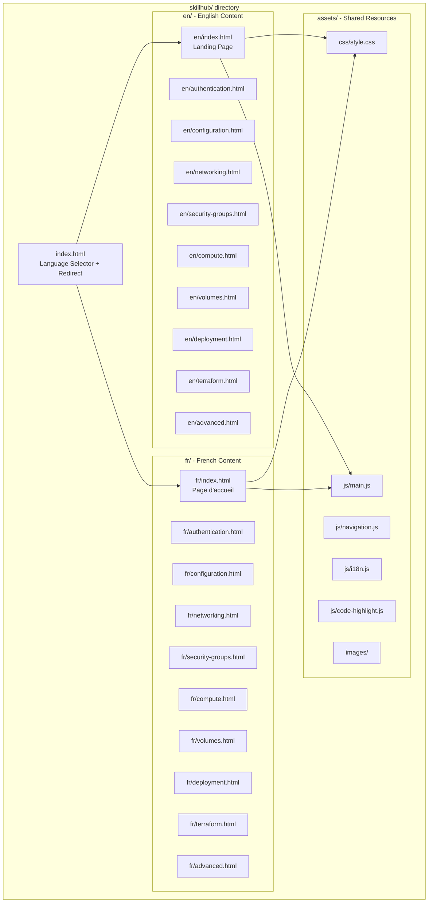
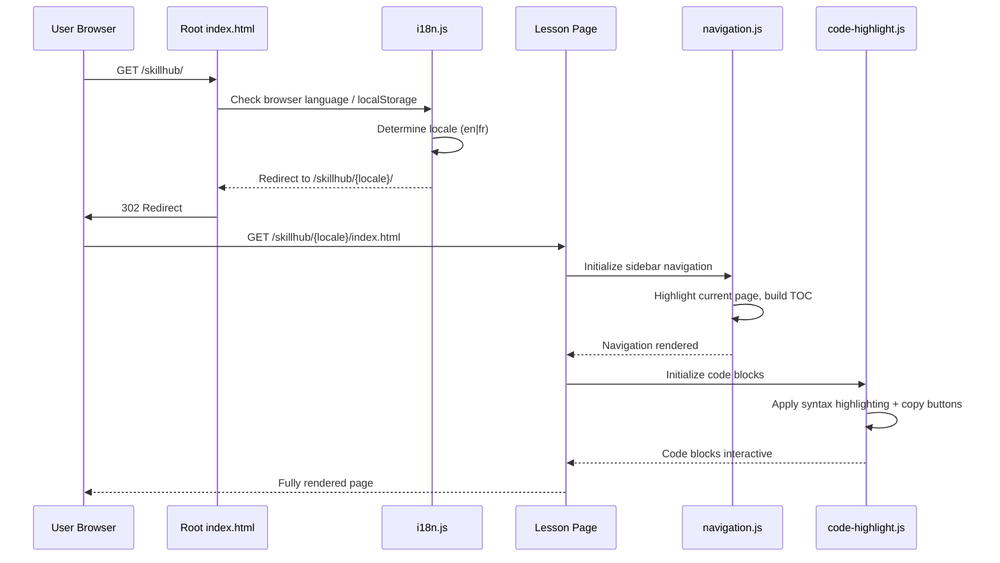
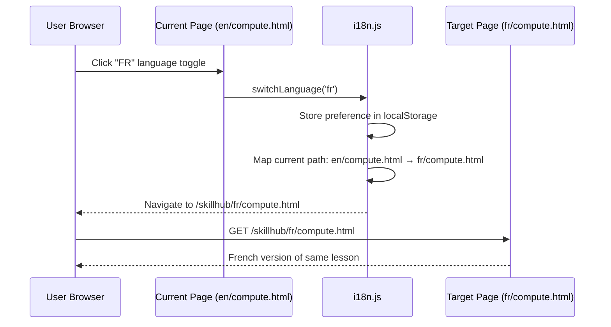
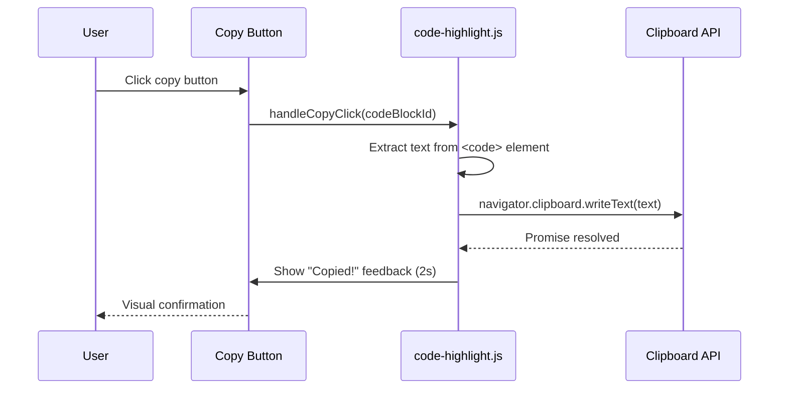

# Design Document: SkillHub Training Site

## Overview

SkillHub is a self-contained, bilingual (English/French) static HTML training website that teaches users how to leverage the opcp-openstack-automation project for Infrastructure as Code (IaC). The site lives in a `skillhub/` subfolder at the project root and is hosted at `https://skillhub.ovhcloud.training`.

The site provides a structured learning path covering all three deployment approaches (Terraform, OpenStack SDK, Ansible) with interactive code examples, copy-to-clipboard functionality, and progressive difficulty from beginner to advanced. It uses no server-side rendering — pure HTML, CSS, and vanilla JavaScript — making it trivially deployable to any static hosting platform.

The bilingual architecture uses a folder-based locale strategy (`/en/` and `/fr/`) with a shared asset layer, ensuring content parity between languages while keeping the build and maintenance process simple.

## Architecture



## Sequence Diagrams

### User Navigation Flow



### Language Switch Flow



### Copy Code Flow



## Components and Interfaces

### Component 1: Language Router (index.html + i18n.js)

**Purpose**: Detects user language preference and routes to the correct locale folder. Provides language switching on all pages.

```pascal
STRUCTURE LanguageRouter
  supportedLocales: LIST OF String    // ["en", "fr"]
  defaultLocale: String               // "en"
  storageKey: String                  // "skillhub-lang"
END STRUCTURE
```

**Interface**:

```pascal
PROCEDURE detectLocale()
  OUTPUT: locale (String)
  // Checks localStorage, then browser navigator.language, falls back to default

PROCEDURE switchLanguage(targetLocale)
  INPUT: targetLocale (String)
  // Stores preference, maps current page path to target locale, navigates

PROCEDURE getCurrentLocale()
  OUTPUT: locale (String)
  // Returns active locale from URL path
```

**Responsibilities**:
- Detect browser language on first visit
- Persist language choice in localStorage
- Map page paths between locales (en/compute.html ↔ fr/compute.html)
- Render language toggle button on every page

### Component 2: Navigation System (navigation.js)

**Purpose**: Renders the sidebar navigation with lesson hierarchy, tracks progress, highlights current page.

```pascal
STRUCTURE NavigationItem
  id: String
  titleEN: String
  titleFR: String
  url: String
  icon: String
  children: LIST OF NavigationItem
  difficulty: ENUM (beginner, intermediate, advanced)
END STRUCTURE

STRUCTURE NavigationState
  currentPage: String
  expandedSections: LIST OF String
  completedLessons: LIST OF String    // Stored in localStorage
END STRUCTURE
```

**Interface**:

```pascal
PROCEDURE renderNavigation(locale, currentPath)
  INPUT: locale (String), currentPath (String)
  // Builds sidebar HTML from lesson structure, highlights active page

PROCEDURE markLessonComplete(lessonId)
  INPUT: lessonId (String)
  // Stores completion in localStorage, updates visual indicator

PROCEDURE getProgress()
  OUTPUT: ProgressInfo (completedCount, totalCount, percentage)
```

**Responsibilities**:
- Render collapsible sidebar with lesson tree
- Track and display learning progress via localStorage
- Highlight current lesson in navigation
- Show difficulty badges (beginner/intermediate/advanced)
- Responsive: collapse to hamburger menu on mobile

### Component 3: Code Block Manager (code-highlight.js)

**Purpose**: Enhances `<pre><code>` blocks with syntax highlighting, copy-to-clipboard, and language labels.

```pascal
STRUCTURE CodeBlock
  id: String
  language: String          // "python", "yaml", "hcl", "bash"
  content: String
  copyable: Boolean
  filename: String          // Optional: displayed as tab header
END STRUCTURE
```

**Interface**:

```pascal
PROCEDURE initializeCodeBlocks()
  // Finds all <pre><code> elements, applies highlighting and copy buttons

PROCEDURE copyToClipboard(codeBlockId)
  INPUT: codeBlockId (String)
  OUTPUT: success (Boolean)
  // Copies code text to clipboard, shows feedback

PROCEDURE highlightSyntax(element, language)
  INPUT: element (HTMLElement), language (String)
  // Applies CSS-based syntax highlighting classes
```

**Responsibilities**:
- Lightweight CSS-based syntax highlighting (no heavy library dependency)
- Support for Python, YAML, JSON, HCL (Terraform), Bash
- Copy-to-clipboard with visual feedback
- Optional filename/tab display above code blocks
- Line numbers for longer code snippets

### Component 4: Page Template System

**Purpose**: Provides consistent HTML structure across all lesson pages with shared header, footer, sidebar, and content area.

```pascal
STRUCTURE PageTemplate
  locale: String
  title: String
  description: String
  currentLesson: String
  previousLesson: String       // For prev/next navigation
  nextLesson: String
  breadcrumbs: LIST OF BreadcrumbItem
END STRUCTURE

STRUCTURE BreadcrumbItem
  label: String
  url: String
END STRUCTURE
```

**Responsibilities**:
- Consistent header with logo, language toggle, progress bar
- Sidebar navigation (Component 2)
- Main content area with breadcrumbs
- Previous/Next lesson navigation at bottom
- Footer with project links and license info
- Responsive layout (mobile-first CSS)

## Data Models

### Lesson Structure

```pascal
STRUCTURE LessonDefinition
  id: String                    // "authentication", "compute", etc.
  slug: String                  // URL-friendly name
  difficulty: ENUM (beginner, intermediate, advanced)
  estimatedMinutes: Integer
  prerequisites: LIST OF String // Lesson IDs
  topics: LIST OF String
END STRUCTURE
```

**Lesson Catalog**:

| ID | Slug | Difficulty | Est. Time | Prerequisites |
|---|---|---|---|---|
| intro | index | beginner | 5 min | none |
| auth | authentication | beginner | 15 min | intro |
| config | configuration | beginner | 20 min | auth |
| network | networking | intermediate | 20 min | config |
| secgroup | security-groups | intermediate | 20 min | config |
| compute | compute | intermediate | 25 min | network, secgroup |
| volumes | volumes | intermediate | 20 min | compute |
| deploy | deployment | advanced | 30 min | all intermediate |
| terraform | terraform | intermediate | 30 min | config |
| advanced | advanced | advanced | 25 min | deploy, terraform |

**Validation Rules**:
- Each lesson ID must be unique
- Prerequisites must reference existing lesson IDs
- No circular dependencies in prerequisites
- estimatedMinutes must be positive integer
- Every lesson must have both EN and FR content files

### Site Configuration

```pascal
STRUCTURE SiteConfig
  baseUrl: String               // "https://skillhub.ovhcloud.training"
  projectName: String           // "opcp-openstack-automation"
  supportedLocales: LIST OF String  // ["en", "fr"]
  defaultLocale: String         // "en"
  analyticsEnabled: Boolean     // false for static site
END STRUCTURE
```

## Algorithmic Pseudocode

### Language Detection and Routing Algorithm

```pascal
ALGORITHM detectAndRoute()
INPUT: none (reads from browser context)
OUTPUT: redirects user to correct locale page

BEGIN
  // Step 1: Check stored preference
  storedLocale ← localStorage.getItem("skillhub-lang")
  
  IF storedLocale IS NOT NULL AND storedLocale IN supportedLocales THEN
    REDIRECT TO "/" + storedLocale + "/index.html"
    RETURN
  END IF
  
  // Step 2: Check browser language
  browserLang ← navigator.language.substring(0, 2).toLowerCase()
  
  IF browserLang IN supportedLocales THEN
    localStorage.setItem("skillhub-lang", browserLang)
    REDIRECT TO "/" + browserLang + "/index.html"
    RETURN
  END IF
  
  // Step 3: Fall back to default
  localStorage.setItem("skillhub-lang", defaultLocale)
  REDIRECT TO "/" + defaultLocale + "/index.html"
  RETURN
END
```

**Preconditions:**
- Browser supports localStorage
- supportedLocales contains at least one entry
- defaultLocale is a member of supportedLocales

**Postconditions:**
- User is redirected to a valid locale landing page
- Language preference is persisted in localStorage

### Language Switch Algorithm

```pascal
ALGORITHM switchLanguage(targetLocale)
INPUT: targetLocale (String)
OUTPUT: navigates to equivalent page in target locale

BEGIN
  ASSERT targetLocale IN supportedLocales
  
  currentPath ← window.location.pathname
  currentLocale ← getCurrentLocale()
  
  // Map path: replace /en/ with /fr/ or vice versa
  newPath ← currentPath.replace("/" + currentLocale + "/", "/" + targetLocale + "/")
  
  // Persist preference
  localStorage.setItem("skillhub-lang", targetLocale)
  
  // Navigate
  window.location.href ← newPath
END
```

**Preconditions:**
- targetLocale is a valid supported locale
- Current page path contains a locale segment

**Postconditions:**
- localStorage updated with new preference
- Browser navigates to equivalent page in target locale

### Navigation Rendering Algorithm

```pascal
ALGORITHM renderNavigation(locale, currentPath)
INPUT: locale (String), currentPath (String)
OUTPUT: sidebar HTML rendered in DOM

BEGIN
  lessons ← getLessonCatalog()
  completedLessons ← getCompletedLessons()
  sidebarElement ← document.getElementById("sidebar-nav")
  html ← ""
  
  FOR EACH lesson IN lessons DO
    // Determine visual state
    isActive ← (currentPath CONTAINS lesson.slug)
    isCompleted ← (lesson.id IN completedLessons)
    
    // Build CSS classes
    classes ← "nav-item"
    IF isActive THEN classes ← classes + " active" END IF
    IF isCompleted THEN classes ← classes + " completed" END IF
    
    // Get localized title
    title ← getLocalizedTitle(lesson, locale)
    
    // Build difficulty badge
    badge ← buildDifficultyBadge(lesson.difficulty)
    
    // Append HTML
    html ← html + buildNavItemHTML(lesson, title, classes, badge)
  END FOR
  
  sidebarElement.innerHTML ← html
  
  // Update progress bar
  progress ← (COUNT OF completedLessons) / (COUNT OF lessons) * 100
  updateProgressBar(progress)
END
```

**Preconditions:**
- DOM element with id "sidebar-nav" exists
- Lesson catalog is defined and non-empty
- locale is a valid supported locale

**Postconditions:**
- Sidebar contains one nav item per lesson
- Current page is visually highlighted
- Completed lessons show checkmark indicator
- Progress bar reflects completion percentage

**Loop Invariants:**
- All previously rendered nav items have correct active/completed state
- html string contains valid HTML fragments

### Code Block Initialization Algorithm

```pascal
ALGORITHM initializeCodeBlocks()
INPUT: none (reads from DOM)
OUTPUT: all code blocks enhanced with highlighting and copy buttons

BEGIN
  codeBlocks ← document.querySelectorAll("pre > code")
  
  FOR EACH block IN codeBlocks DO
    // Extract language from class (e.g., "language-python")
    language ← extractLanguage(block.className)
    
    IF language IS NOT NULL THEN
      // Apply syntax highlighting
      highlightSyntax(block, language)
    END IF
    
    // Add copy button
    copyBtn ← createCopyButton(block.id)
    block.parentElement.insertBefore(copyBtn, block)
    
    // Add language label
    IF language IS NOT NULL THEN
      label ← createLanguageLabel(language)
      block.parentElement.insertBefore(label, block)
    END IF
    
    // Add line numbers for blocks > 5 lines
    lineCount ← countLines(block.textContent)
    IF lineCount > 5 THEN
      addLineNumbers(block, lineCount)
    END IF
  END FOR
END
```

**Preconditions:**
- DOM is fully loaded (DOMContentLoaded fired)
- Code blocks use standard `<pre><code class="language-xxx">` markup

**Postconditions:**
- All code blocks have syntax highlighting applied
- All code blocks have a copy button
- Blocks with >5 lines have line numbers
- Language labels are displayed

**Loop Invariants:**
- All previously processed code blocks are fully enhanced
- No code block is processed more than once

### Copy to Clipboard Algorithm

```pascal
ALGORITHM copyToClipboard(codeBlockId)
INPUT: codeBlockId (String)
OUTPUT: success (Boolean)

BEGIN
  element ← document.getElementById(codeBlockId)
  
  IF element IS NULL THEN
    RETURN false
  END IF
  
  text ← element.textContent
  
  TRY
    AWAIT navigator.clipboard.writeText(text)
    
    // Show success feedback
    button ← element.parentElement.querySelector(".copy-btn")
    originalText ← button.textContent
    button.textContent ← "✓ Copied!"
    button.classList.add("copied")
    
    // Reset after 2 seconds
    AFTER 2000ms DO
      button.textContent ← originalText
      button.classList.remove("copied")
    END AFTER
    
    RETURN true
  CATCH error
    // Fallback: select text for manual copy
    selectText(element)
    RETURN false
  END TRY
END
```

**Preconditions:**
- codeBlockId references an existing DOM element
- Browser supports Clipboard API (fallback for older browsers)

**Postconditions:**
- On success: text is in clipboard, button shows confirmation for 2s
- On failure: text is selected for manual Ctrl+C

## Key Functions with Formal Specifications

### Function 1: detectLocale()

```pascal
PROCEDURE detectLocale()
  OUTPUT: locale (String)
```

**Preconditions:**
- `supportedLocales` array is non-empty
- `defaultLocale` is a member of `supportedLocales`

**Postconditions:**
- Returns a string that is a member of `supportedLocales`
- If localStorage has a valid stored preference, returns that value
- If no stored preference, returns browser language if supported, else `defaultLocale`

**Loop Invariants:** N/A

### Function 2: switchLanguage(targetLocale)

```pascal
PROCEDURE switchLanguage(targetLocale)
  INPUT: targetLocale (String)
```

**Preconditions:**
- `targetLocale` is a member of `supportedLocales`
- Current URL path contains a valid locale segment

**Postconditions:**
- localStorage "skillhub-lang" key is set to `targetLocale`
- Browser navigates to the equivalent page in the target locale
- Page structure (lesson) is preserved across the switch

### Function 3: renderNavigation(locale, currentPath)

```pascal
PROCEDURE renderNavigation(locale, currentPath)
  INPUT: locale (String), currentPath (String)
```

**Preconditions:**
- DOM element with id "sidebar-nav" exists
- `locale` is a valid supported locale
- Lesson catalog is defined

**Postconditions:**
- Sidebar DOM is populated with navigation items
- Exactly one item has "active" class (matching currentPath)
- Progress bar percentage equals `completedCount / totalCount * 100`

### Function 4: initializeCodeBlocks()

```pascal
PROCEDURE initializeCodeBlocks()
```

**Preconditions:**
- DOM is fully loaded
- Code blocks use `<pre><code class="language-xxx">` markup

**Postconditions:**
- Every `<pre><code>` element has a copy button sibling
- Every code block with a recognized language class has syntax highlighting
- Blocks with >5 lines have line numbers
- No code block is modified more than once

### Function 5: getProgress()

```pascal
PROCEDURE getProgress()
  OUTPUT: ProgressInfo (completedCount: Integer, totalCount: Integer, percentage: Number)
```

**Preconditions:**
- localStorage is accessible
- Lesson catalog is defined

**Postconditions:**
- `completedCount` >= 0 and <= `totalCount`
- `totalCount` equals the number of lessons in the catalog
- `percentage` equals `completedCount / totalCount * 100`
- Returns consistent data with what is stored in localStorage

## Example Usage

### Example 1: Root index.html — Language Detection

```pascal
SEQUENCE
  // On page load
  CALL detectLocale()
  locale ← RESULT
  
  // Redirect to locale-specific landing page
  REDIRECT TO "/" + locale + "/index.html"
END SEQUENCE
```

### Example 2: Lesson Page Initialization

```pascal
SEQUENCE
  // On DOMContentLoaded
  locale ← getCurrentLocale()
  currentPath ← window.location.pathname
  
  // Initialize components
  CALL renderNavigation(locale, currentPath)
  CALL initializeCodeBlocks()
  CALL renderLanguageToggle(locale)
  CALL renderBreadcrumbs(locale, currentPath)
  CALL renderPrevNextButtons(locale, currentPath)
END SEQUENCE
```

### Example 3: User Completes a Lesson

```pascal
SEQUENCE
  // User clicks "Mark as Complete" button
  lessonId ← getCurrentLessonId()
  
  CALL markLessonComplete(lessonId)
  
  // Update UI
  progress ← CALL getProgress()
  CALL updateProgressBar(progress.percentage)
  
  // Show next lesson suggestion
  nextLesson ← getNextLesson(lessonId)
  IF nextLesson IS NOT NULL THEN
    DISPLAY "Next: " + getLocalizedTitle(nextLesson, locale)
  ELSE
    DISPLAY "Congratulations! All lessons completed."
  END IF
END SEQUENCE
```

## Correctness Properties

*A property is a characteristic or behavior that should hold true across all valid executions of a system — essentially, a formal statement about what the system should do. Properties serve as the bridge between human-readable specifications and machine-verifiable correctness guarantees.*

### Property 1: Locale Detection Always Returns a Valid Supported Locale

*For any* combination of localStorage state (present, absent, or invalid) and browser language value, `detectLocale()` shall return a string that is a member of the supported locales list. When a valid stored preference exists, it takes priority over browser language; when no stored preference exists, a supported browser language is returned; otherwise the default locale "en" is returned.

**Validates: Requirements 1.1, 1.2, 1.3, 1.5**

### Property 2: Language Switch Preserves Page and Persists Preference

*For any* valid page path containing a locale segment and any target locale in the supported list, `switchLanguage(targetLocale)` shall produce a new path where only the locale segment is replaced (the slug is preserved), and localStorage shall be updated to the target locale.

**Validates: Requirements 2.1, 2.2, 2.3**

### Property 3: Locale Content Parity

*For any* HTML file `en/{slug}.html` in the English locale folder, there shall exist a corresponding `fr/{slug}.html` in the French locale folder, and the lesson catalog shall define the same ordered list of lessons for both locales.

**Validates: Requirements 3.1, 3.2**

### Property 4: Sidebar Renders Exactly One Active Item

*For any* lesson catalog and any current page path that matches a lesson slug, `renderNavigation()` shall produce a sidebar where exactly one navigation item has the "active" class, and that item corresponds to the current page.

**Validates: Requirements 4.1, 4.2**

### Property 5: Sidebar Items Have Correct Locale Titles and Difficulty Badges

*For any* lesson in the catalog and any supported locale, the rendered navigation item shall display the title matching that locale and shall include a difficulty badge with a value of "beginner", "intermediate", or "advanced".

**Validates: Requirements 4.3, 4.4, 9.2**

### Property 6: Progress Tracking Round-Trip

*For any* lesson ID from the catalog, calling `markLessonComplete(lessonId)` and then reading back from localStorage shall return that lesson as completed. The completion status shall persist across simulated page navigations.

**Validates: Requirements 5.1, 5.4**

### Property 7: Progress Percentage Calculation

*For any* subset of lessons marked as complete from a non-empty lesson catalog, `getProgress()` shall return a percentage equal to `completedCount / totalCount * 100`, where `completedCount` is the size of the completed subset and `totalCount` is the total number of lessons in the catalog.

**Validates: Requirements 5.3, 5.5**

### Property 8: Code Block Initialization Enhancements

*For any* DOM containing `<pre><code>` elements, after calling `initializeCodeBlocks()`: every code block shall have a copy button; every code block with a recognized language class shall have syntax highlighting and a language label; every code block with more than 5 lines shall have line numbers.

**Validates: Requirements 6.1, 6.2, 6.3, 6.4**

### Property 9: Code Block Initialization Idempotency

*For any* DOM state, calling `initializeCodeBlocks()` twice shall produce the same DOM as calling it once — no duplicate copy buttons, no duplicate highlighting, no duplicate labels.

**Validates: Requirement 6.5**

### Property 10: Copy Fidelity

*For any* code block content string, `copyToClipboard(blockId)` shall place text into the clipboard that is byte-identical to the `textContent` of the source `<code>` element.

**Validates: Requirement 7.1**

### Property 11: Page Template Structural Completeness

*For any* lesson page HTML file, the document shall contain: a header element with a language toggle and progress bar, a breadcrumb navigation element, previous/next lesson navigation buttons, and a footer element with project links.

**Validates: Requirements 8.1, 8.2, 8.3, 8.4**

### Property 12: Lesson Catalog Validity

*For any* lesson entry in the catalog, the difficulty shall be one of {beginner, intermediate, advanced}, all prerequisite IDs shall reference existing lessons in the catalog, and the estimated time shall be a positive integer.

**Validates: Requirements 9.2, 9.3, 9.5**

### Property 13: No External Runtime Dependencies

*For any* HTML, CSS, or JavaScript file in the `skillhub/` directory, the file shall contain zero references to external CDN URLs or external API endpoints. All `src` and `href` attributes shall reference paths within `skillhub/assets/` or relative locale paths.

**Validates: Requirements 12.1, 12.2**

### Property 14: ARIA Labels on Interactive Elements

*For any* interactive element (button, anchor with href, input, toggle) in any HTML page, the element shall have an appropriate `aria-label`, `aria-labelledby`, or accessible text content.

**Validates: Requirement 13.2**

## Error Handling

### Error Scenario 1: localStorage Unavailable

**Condition**: Browser has localStorage disabled (private browsing, security settings)
**Response**: Fall back to browser language detection only; progress tracking degrades gracefully (no persistence across sessions)
**Recovery**: Site remains fully functional for reading content; progress indicators show 0% but lessons are still accessible

### Error Scenario 2: Clipboard API Unavailable

**Condition**: Older browser or insecure context (HTTP instead of HTTPS)
**Response**: `copyToClipboard()` catches the error and falls back to selecting the text in the code block
**Recovery**: User sees selected text and can manually Ctrl+C; copy button shows "Select + Ctrl+C" instead of "Copied!"

### Error Scenario 3: Invalid Locale in URL

**Condition**: User manually navigates to `/skillhub/de/index.html` (unsupported locale)
**Response**: 404 page with links to supported locales
**Recovery**: Custom 404.html in `skillhub/` directory redirects to root language selector

### Error Scenario 4: Missing Page Translation

**Condition**: A page exists in EN but not yet in FR (during development)
**Response**: Language toggle for that page shows a "translation pending" indicator
**Recovery**: Clicking the toggle navigates to the FR landing page instead of a broken link

## Testing Strategy

### Unit Testing Approach

Test the JavaScript modules in isolation:

- **i18n.js**: Test `detectLocale()` with mocked localStorage and navigator.language values. Verify correct locale selection priority (stored > browser > default).
- **navigation.js**: Test `renderNavigation()` with mock DOM. Verify correct active state, progress calculation, and HTML output.
- **code-highlight.js**: Test `initializeCodeBlocks()` with mock code block elements. Verify copy button creation, language label, and line number logic.

Coverage goal: 90%+ for all JavaScript utility functions.

### Property-Based Testing Approach

**Property Test Library**: fast-check (JavaScript)

Properties to test:
- For any valid locale in `supportedLocales`, `switchLanguage(locale)` produces a valid URL path
- For any lesson catalog, `getProgress()` returns percentage in [0, 100]
- For any code block content, `copyToClipboard()` preserves the exact text (no whitespace mutation)
- For any combination of completed lessons, navigation rendering is consistent

### Integration Testing Approach

- **Link Validation**: Crawl all HTML files and verify every `<a href>` points to an existing file or valid anchor
- **Locale Parity Check**: Script that compares `en/` and `fr/` directories to ensure 1:1 file mapping
- **HTML Validation**: Run W3C validator on all HTML files
- **Accessibility Audit**: Run axe-core on all pages to check ARIA labels, contrast ratios, keyboard navigation
- **Responsive Testing**: Verify layout at 320px, 768px, 1024px, 1440px viewport widths

## Performance Considerations

- **No JavaScript frameworks**: Vanilla JS only — keeps bundle size minimal (estimated <15KB total JS)
- **CSS-only syntax highlighting**: Avoids loading Prism.js or Highlight.js (~30-50KB savings)
- **Lazy image loading**: Use `loading="lazy"` on all `` tags
- **Minimal HTTP requests**: Single CSS file, single bundled JS file, inline SVG icons
- **Cache-friendly**: Static assets use content-based filenames for cache busting
- **Target metrics**: First Contentful Paint < 1s, Total page weight < 200KB

## Security Considerations

- **No user input processing**: Static site with no forms, no backend, no database
- **No external script loading**: All JS is self-hosted — no CDN dependencies, no tracking scripts
- **Content Security Policy**: Recommend CSP headers via hosting config: `default-src 'self'; script-src 'self'; style-src 'self' 'unsafe-inline'`
- **HTTPS only**: Site hosted at `https://skillhub.ovhcloud.training` — all links use relative paths
- **No credential exposure**: Training content shows placeholder credentials (`${OS_USERNAME}`, etc.), never real values

## Dependencies

- **Runtime**: None — pure HTML5, CSS3, vanilla JavaScript (ES6+)
- **Build/Dev** (optional):
  - A simple file server for local development (e.g., `python -m http.server`)
  - W3C HTML validator for CI checks
  - axe-core for accessibility testing
- **Hosting**: Any static file hosting (nginx, Apache, S3 + CloudFront, GitHub Pages, etc.)
- **Browser Support**: Modern browsers (Chrome 80+, Firefox 78+, Safari 13+, Edge 80+)
